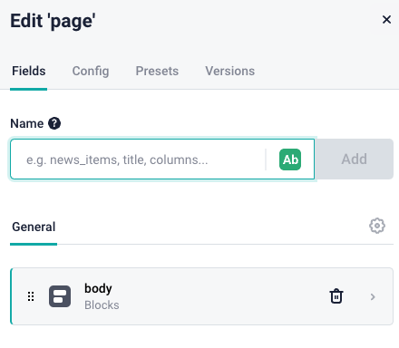
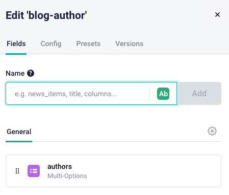

# storyblok-simple-app

This projects intends to be used to facilitate test when using the [Storyblok Bridge](https://www.storyblok.com/docs/Guides/storyblok-latest-js)

## Project Setup

```sh
npm install
```

### Compile and Hot-Reload for Development

Create an `.env` with the access token for your space

```sh
npm run dev
```

### Compile and Minify for Production

```sh
npm run build
```

## Storyblok Space project

This is the current components structure

### page



### feature


### teaser


### grid


### blog-posts


### blog-authors

